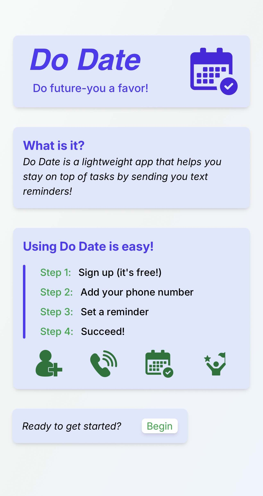
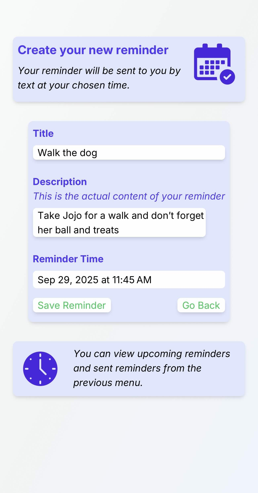
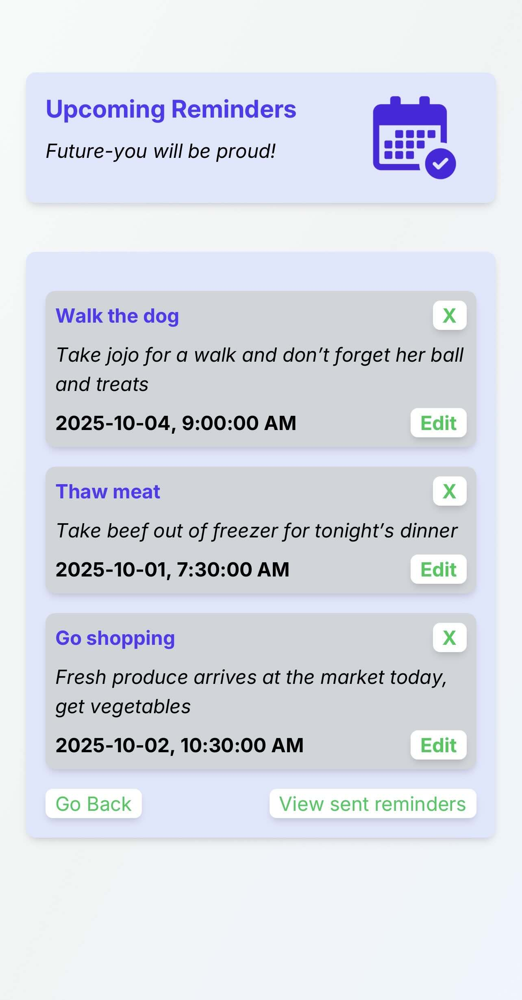
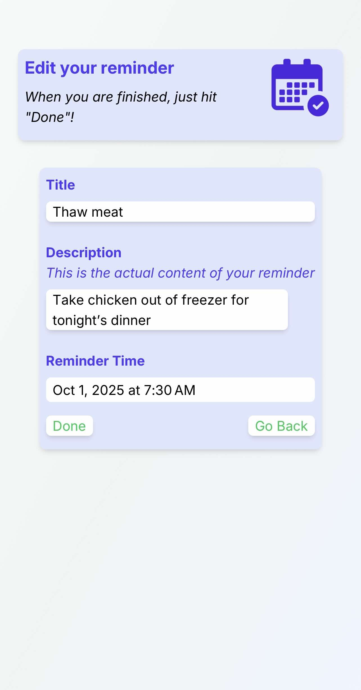

# Do Date - SMS Reminder Application

A full-stack web application that allows users to create, manage, and receive SMS reminders at scheduled times. Built with React, Express, AWS services, and Twilio.

## Features

- **User Authentication**: Secure signup/login with AWS Cognito
- **Phone Verification**: SMS-based phone number verification via Twilio
- **Reminder Management**: Create, view, edit, and delete reminders
- **Scheduled SMS Notifications**: Automatic SMS reminders sent at user-specified times
- **Timezone Support**: Automatic timezone detection for accurate reminder delivery
- **Responsive UI**: Modern, user-friendly interface built with React and Tailwind CSS

## Screenshots

### Landing Page


### Create Reminder


### View Reminders


### Edit Reminder


## Tech Stack

### Frontend
- **React** (v19.1.1) with TypeScript
- **Vite** - Build tool and development server
- **AWS Amplify** - Authentication and user management
- **Tailwind CSS** - Styling and UI components

### Backend
- **Node.js** with Express.js
- **AWS SDK** - DynamoDB, Cognito, EventBridge integration
- **Twilio** - SMS messaging service
- **JWT Authentication** - Secure API endpoints

### AWS Services
- **Amazon Cognito** - User authentication and management
- **Amazon DynamoDB** - NoSQL database for reminders and user data
- **AWS EventBridge** - Scheduled event triggering
- **AWS Lambda** - Serverless function for sending reminders

## Getting Started

### Prerequisites
- Node.js (v18 or higher)
- npm or yarn
- AWS Account
- Twilio Account

### Installation

#### 1. Clone the repository
```bash
git clone https://github.com/yourusername/Reminder_App.git
cd Reminder_App
```

#### 2. Backend Setup
```bash
cd backend
npm install

# Create .env file with the following variables:
# AWS_REGION=your-aws-region
# TWILIO_ACCOUNT_SID=your-twilio-sid
# TWILIO_AUTH_TOKEN=your-twilio-auth-token
# TWILIO_PHONE_NUMBER=your-twilio-number

npm run dev  # Start development server
```

#### 3. Frontend Setup
```bash
cd reminder_app_frontend
npm install

# Create .env file with the following variables:
# VITE_API_URL=http://localhost:3001
# VITE_AWS_REGION=your-aws-region

npm run dev  # Start development server
```

#### 4. AWS Setup

##### DynamoDB Tables:
1. **Reminders-3**
   - Partition key: `userId` (String)
   - Sort key: `reminderId` (String)

2. **verified-phone-numbers**
   - Partition key: `userId` (String)
   - Sort key: `phoneNumber` (String)

3. **verification-codes**
   - Partition key: `phoneNumber` (String)
   - TTL attribute: `ttl` (Number)

##### Lambda Function:
- Deploy the `sendReminders` Lambda function
- Set environment variables (AWS_REGION, TWILIO credentials)
- Configure IAM permissions for DynamoDB, EventBridge

##### Cognito User Pool:
- Set up a Cognito User Pool via AWS Amplify
- Configure custom attributes if needed

## Environment Variables

### Backend (.env)

AWS_REGION=us-east-2
TWILIO_ACCOUNT_SID=your_account_sid
TWILIO_AUTH_TOKEN=your_auth_token
TWILIO_PHONE_NUMBER=+1234567890

### Frontend (.env)

VITE_API_URL=http://localhost:3001
VITE_AWS_REGION=us-east-2

## Usage

1. **Sign Up / Login**: Create an account or log in with existing credentials
2. **Verify Phone Number**: Enter and verify your phone number via SMS
3. **Create Reminders**: Set title, description, and desired reminder time
4. **View Reminders**: See all upcoming and sent reminders
5. **Edit/Delete Reminders**: Manage your reminders as needed
6. **Receive SMS**: Get SMS notifications at your scheduled times

## API Endpoints

### Authentication
- `POST /api/send-verification-sms` - Send verification code to phone
- `POST /api/verify-phone` - Verify phone number with code
- `POST /api/check-phone-verification` - Check verification status

### Reminders (Protected)
- `POST /api/add-reminder` - Create a new reminder
- `GET /api/get-reminders` - Get all user reminders
- `DELETE /api/delete-reminder/:reminderId` - Delete a reminder
- `POST /api/edit-reminder/:reminderId` - Edit an existing reminder

## How It Works

1. **User creates a reminder** with a specific date/time
2. **Backend stores reminder** in DynamoDB
3. **EventBridge rule created** with cron expression for scheduled time
4. **EventBridge triggers Lambda** at the scheduled time
5. **Lambda sends SMS** via Twilio to user's verified phone number
6. **Reminder marked as sent** in DynamoDB

## Deployment

### Frontend (Vercel)
```bash
cd reminder_app_frontend
npm run build
# Deploy to Vercel via CLI or GitHub integration
```

### Backend (Railway)
- Connect your GitHub repository to Railway
- Set environment variables in Railway dashboard
- Deploy automatically on git push

### Lambda Function
- Zip the Lambda function with dependencies
- Upload to AWS Lambda Console
- Configure environment variables and IAM permissions

## Security

- **JWT Authentication**: All protected routes use Cognito access tokens
- **AWS IAM**: Proper permissions for DynamoDB, EventBridge, and Lambda
- **Environment Variables**: Sensitive credentials stored securely
- **CORS Configuration**: Restricted to trusted domains

## Timezone Handling

The app automatically detects the user's timezone using the browser's `Intl.DateTimeFormat()` API and converts all reminder times to UTC for EventBridge scheduling. This ensures reminders are delivered at the correct local time regardless of where the server is hosted.

## Known Issues

- Token expiration requires user to re-authenticate
- EventBridge rules are not automatically cleaned up after reminder is sent
- Production environment may require additional CORS configuration

## Future Enhancements

- Recurring reminders (daily, weekly, monthly)
- Email notifications in addition to SMS
- Reminder categories and tags
- User profile settings (timezone, notification preferences)
- Dark mode support

## License

This project is licensed under the MIT License.

## Acknowledgments

- AWS Amplify for authentication framework
- Twilio for SMS messaging service
- Tailwind CSS for styling framework
